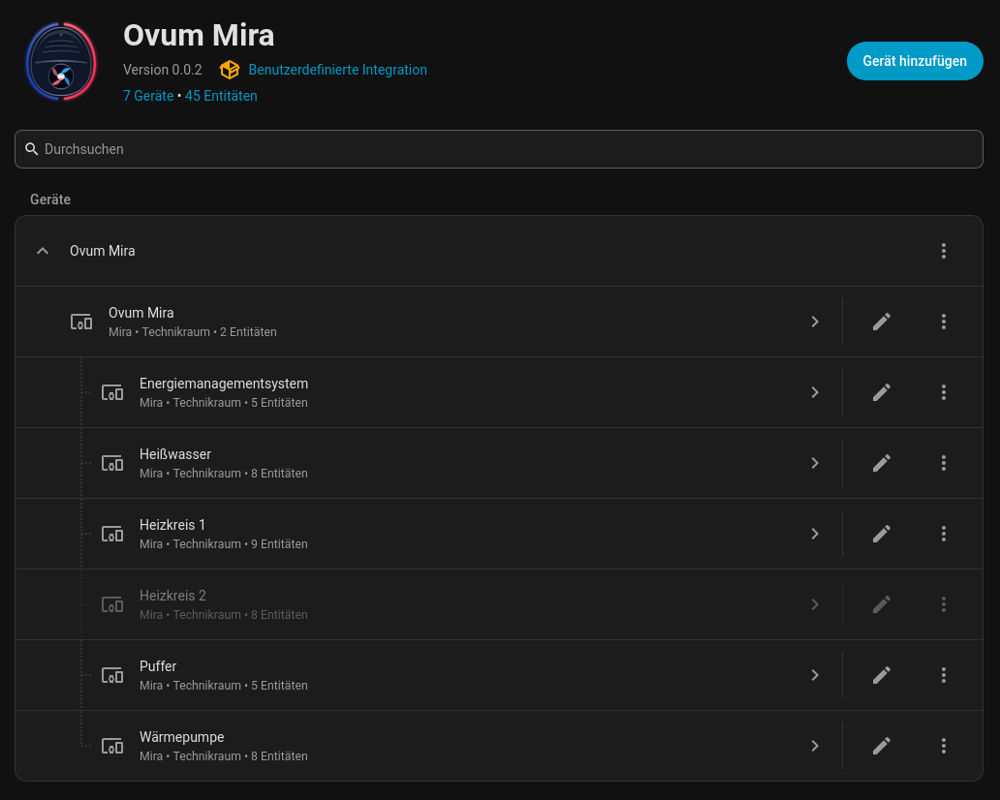

# Ovum Mira Heat Pump Integration for Home Assistant (HACS)

This custom integration integrates **Ovum Mira heat pump systems** with Home Assistant using the new **Modbus
Connection** framework.

This is not an official integration and not sponsored by Ovum.

The underlying device communication is done through the [ovum-mira-modbus](https://github.com/aleho/ovum-mira-modbus/)
libray implementation.

---

## Features

- **Multi-Unit Topology**: Seamlessly communicates across HSM (Heating Manager) and WPM (Heat Pump).
- **Climate Platform**: View and set target flow temperature for Heating Circuits.
- **Water Heater Platform**: View and control Hot Water (WW) reservoir temperatures.
- **Sensors**:
    - Outdoor temperature (°C)
    - Heat pump operating status enum
    - Heat pump electrical power consumption (kW)
    - Heat pump thermal power production (kW)
    - Heat pump demand (%)
    - Heating circuit flow and room temperatures (°C)
    - DHW top and bottom reservoir temperatures (°C)
    - Buffer tank actual and target temperatures (°C)

---

## Installation via HACS

1. Make sure you have [HACS](https://hacs.xyz/) installed in your Home Assistant instance.
2. In HACS, go to **Integrations** > Three dots menu in top-right > **Custom repositories**.
3. Add this repository URL, choose **Integration** as category, and click **Add**.
4. Search for **Ovum Mira** in HACS, click **Download**, and restart Home Assistant.

---

## Configuration

1. In Home Assistant, go to **Settings** > **Devices & Services**.
2. Click **Add Integration** and search for **Ovum Mira**.
3. Setup Modbus TCP connection parameters, confirm the unit ID of your heat pump.
4. Save.

---

## Development

- `mkdir ha-ovum-mira && cd ha-ovum-mira`
- `git clone https://github.com/aleho/ovum-mira-modbus.git`
- `git clone https://github.com/aleho/ha-ovum-mira-hacs.git`
- `cd ha-ovum-mira-hacs && bin/install_dev.sh`

This should get you a local setup where you can develop the library and integration from one single environment.

To test this integration in a real Home Assistant setup, use `bin/run_ha.sh` to start HA in a container with your local sources already mounted into the `custom_components` folder.

---

## AI

This repository was initially generated pointing AI at the
[blog post](https://developers.home-assistant.io/blog/2026/07/05/modernizing-modbus/)
describing new features in Home Assistant's Modbus implementation. The results
were full of hallucinations and needed a lot of work.

Most structuring and implementation hints were taken from
https://github.com/Tom-Bom-badil/trovis-modbus-hass/.

The brand logo was generated using AI, as this integration is not official and
not sponsored by Ovum.

Further development, adaptations, fixes, etc. were done without any AI.

---

## License

Apache License 2.0. See [LICENSE](LICENSE) for details.
